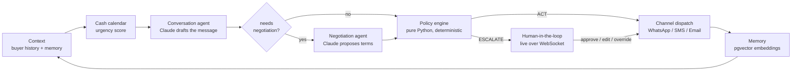

# SimplyCashIN

[](https://github.com/ShreeniG99/SimplyCashIN/actions/workflows/ci.yml)

**Agentic receivables collection for Indian MSMEs.** An AI agent that chases overdue invoices over WhatsApp/SMS/email, negotiates payment plans inside owner-defined guardrails, and hands control to a human the moment judgment is required — live, over a WebSocket.

> 🎬 **2-minute demo video:** _coming soon — link will be added here_

India's ~63 million small businesses collect receivables the manual way: the owner personally calls and messages buyers, every week. SimplyCashIN gives the owner an agent that does the chasing — and knows what it must never do without a human.

---

## How it works

Every overdue invoice runs through one auditable decision loop:



**Design decisions that matter:**

- **The ACT-vs-ESCALATE branch is never an LLM call.** The policy engine is pure, deterministic Python evaluating owner guardrails (max extension days, min upfront %, relationship tier) — every decision is auditable and reproducible.
- **The LLM sits behind a seam.** `AnthropicClient` (Claude) in production, a deterministic `StubLLM` everywhere else — the entire test suite runs offline, and SDK errors map to typed `LLMError`s that escalate instead of failing silently.
- **Detection and dispatch never overlap.** APScheduler *detects* overdue invoices daily and ranks them into a Redis urgency queue; a Celery worker *drains* the queue and dispatches, highest urgency first, with bounded retries. Exhausted retries escalate — nothing is silently dropped.
- **Escalations are realtime.** `WS /ws/escalations` pushes new escalations to the owner's screen instantly; approve/edit/override travels back over the same socket, and the agent **remembers the owner's edits** for next time.
- **Multi-tenant by construction.** With `SUPABASE_JWT_SECRET` set, every request is owner-scoped via JWT → Postgres row-level security + repository filters. Unset, a dev fallback keeps local runs friction-free.
- **Money is integer paise** end-to-end; `₹` formatting (Indian digit grouping) happens only at the API edge.

## What's built

| Milestone | Scope | Status |
|---|---|---|
| M1 | End-to-end decision loop: Context → Conversation → Negotiation → Orchestrator → dispatch → Memory, behind FastAPI + Postgres/pgvector | ✅ |
| M2 | CSV/WhatsApp invoice ingestion, Redis urgency queue, memory vectorization | ✅ |
| M3 | APScheduler detection + Celery dispatch, Twilio WhatsApp/SMS + SMTP email channels, inbound reply webhook | ✅ |
| M4 | Supabase JWT auth, multi-tenancy with Postgres RLS | ✅ |
| M5 | Realtime HITL WebSocket gateway, wired to the React escalation screen | ✅ |

**Stack:** Python 3.12 · FastAPI · SQLAlchemy 2 (async) + asyncpg · Alembic · Postgres + pgvector · Redis · Celery · APScheduler · Anthropic SDK · Pydantic v2 · pytest — React 18 · Vite · Framer Motion on the front.

```
backend/
  app/agents/        Context, Conversation, Negotiation, Orchestrator
  app/services/      cash calendar (urgency), policy engine, memory
  app/llm/           LLM seam: AnthropicClient / StubLLM
  app/channels/      Twilio, SMTP, simulated — env-driven factory
  app/dispatch/      Celery worker (queue drain → agent cycle → send)
  app/api/           FastAPI routes, WS gateway, JWT deps
  tests/             91 tests; stub LLM, db-marked, integration-marked
frontend/            React dashboard, conversation, escalation screens
```

## Quickstart (Windows / PowerShell)

Prereqs: **Python 3.12+**, **Node 18+**, **Docker Desktop** running.

```powershell
git clone https://github.com/ShreeniG99/SimplyCashIN.git
cd SimplyCashIN\backend

# 1. Infrastructure (Postgres+pgvector, Redis)
docker compose up -d

# 2. Python env + deps
python -m venv .venv
.\.venv\Scripts\Activate.ps1
pip install -e ".[dev]"

# 3. Config — stub LLM needs no API key; set ANTHROPIC_API_KEY + USE_STUB_LLM=0 for real Claude
Copy-Item .env.example .env
# demo mode: run with the deterministic stub
$env:USE_STUB_LLM = "1"

# 4. Schema + demo data (Ramesh Iyer's auto-parts business, 5 buyers)
python -m alembic upgrade head
python scripts\seed_dev.py

# 5. API
python -m uvicorn app.api.app:app --port 8001
```

Second terminal — frontend:

```powershell
cd SimplyCashIN\frontend
npm install
npm run dev    # http://localhost:5173 (talks to the API on :8001)
```

Drive the decision loop:

```powershell
# rajan: ordinary overdue invoice → agent ACTs (drafts + sends a reminder)
Invoke-RestMethod -Method Post http://localhost:8001/buyers/rajan/run-cycle

# anand: proposed terms breach owner policy → agent ESCALATEs
Invoke-RestMethod -Method Post http://localhost:8001/buyers/anand/run-cycle
# → approve/edit it live on the Escalations screen (WebSocket, no refresh)

# ingest a whole invoice book, detect overdue, queue by urgency
curl.exe -F "file=@tests\fixtures\invoices.csv" http://localhost:8001/ingest/csv
Invoke-RestMethod -Method Post http://localhost:8001/schedule/trigger

# a buyer replies — lands in the conversation thread
curl.exe -X POST "http://localhost:8001/webhooks/twilio?buyer_id=anand" -d "Body=Will pay Friday"
```

Tests:

```powershell
cd backend
$env:USE_STUB_LLM = "1"
python -m pytest          # db tests auto-skip if Postgres is down
```

Operational detail — the scheduler/Celery split, channel credentials, auth setup, and the full demo script — lives in [backend/README.md](backend/README.md).
